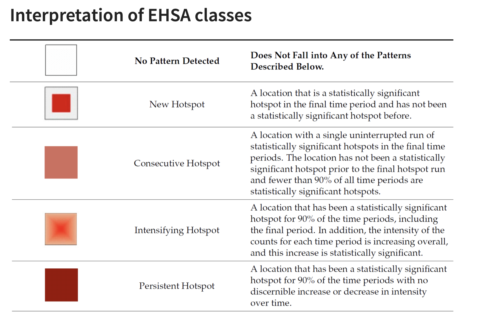
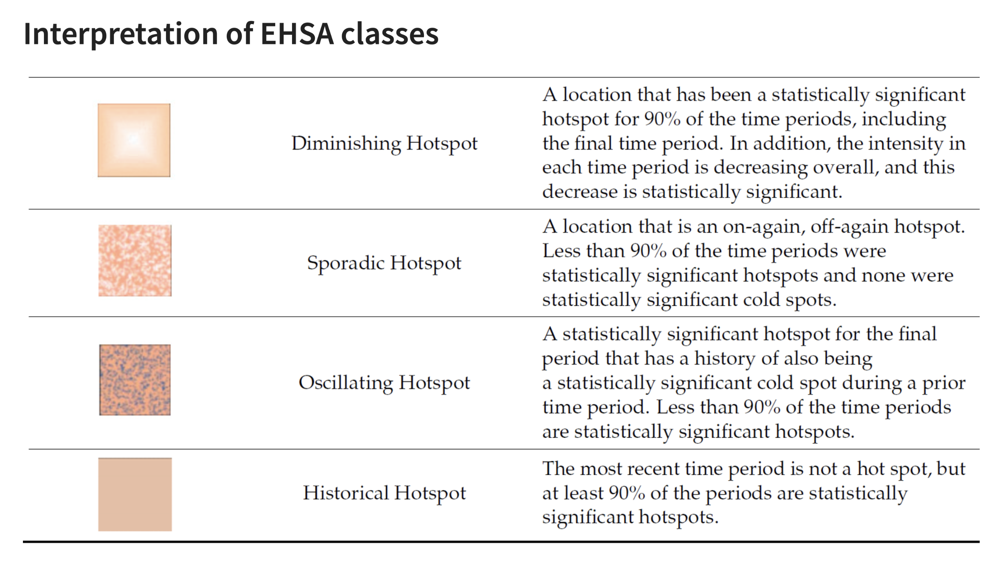
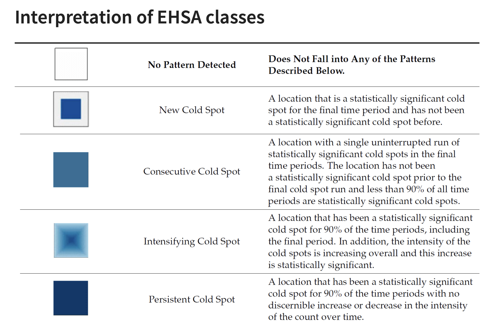
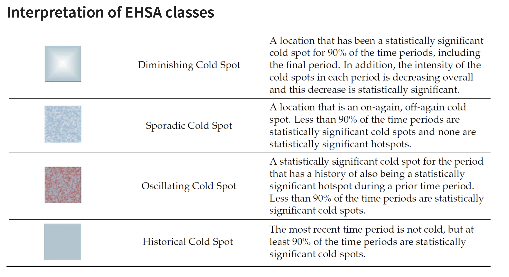

# 1 Getting started

## 1.1 Installing and Loading the R Packages

As usual, p_load() of pacman package will be used to check if the necessary packages have been installed in R, if yes, load the packages on R environment. Six R packages are need for this in-class exercise, they are: sf, sfdep, tmap, plotly, and tidyverse.

```{r}
pacman::p_load(sf, sfdep, tmap, 
               plotly, tidyverse, 
               Kendall)
```

## 1.2 The Data

For the purpose of this in-class exercise, the Hunan data sets will be used. There are two data sets in this use case, they are: 1. Hunan, a geospatial data set in ESRI shapefile format, and 2. Hunan_2012, an attribute data set in csv format.

```{r}
hunan <- st_read(dsn = "data/geospatial", 
                 layer = "Hunan") %>% 
  st_transform(crs = 32650)
```

## 1.3 Importing Attribute Table

```{r}
GDPPC <- read_csv("data/aspatial/Hunan_GDPPC.csv")
```

## 1.4 Creating a Time Series Cube

```{r}
GDPPC_st <- spacetime(GDPPC, hunan,
                      .loc_col = "County",
                      .time_col = "Year")

is_spacetime_cube(GDPPC_st)
```

## 1.5 Computing Gi\*

```{r}
GDPPC_nb <- GDPPC_st %>%
  activate("geometry") %>%
  mutate(nb = include_self(
    st_contiguity(geometry)),
    wt = st_inverse_distance(nb, 
                             geometry, 
                             scale = 1,
                             alpha = 1),
    .before = 1) %>%
  set_nbs("nb") %>%
  set_wts("wt")

gi_stars <- GDPPC_nb %>% 
  group_by(Year) %>% 
  mutate(gi_star = local_gstar_perm(
    GDPPC, nb, wt)) %>% 
  tidyr::unnest(gi_star)
```

## 1.6 Mann-Kendall Test

A **monotonic series** or function is one that only increases (or decreases) and never changes direction. So long as the function either stays flat or continues to increase, it is monotonic.

H0: No monotonic trend

H1: Monotonic trend is present

**Interpretation**

-   Reject the null-hypothesis null if the p-value is smaller than the alpha value (i.e. 1-confident level)

-   Tau ranges between -1 and 1 where:

    -   -1 is a perfectly decreasing series, and

    -   1 is a perfectly increasing series.

## 1.7 Mann-Kendall Test on Gi

```{r}
cbg <- gi_stars %>% 
  ungroup() %>% 
  filter(County == "Changsha") |> 
  select(County, Year, gi_star)

ggplot(data = cbg, 
       aes(x = Year, 
           y = gi_star)) +
  geom_line() +
  theme_light()
```

## 1.8 Interactive Mann-Kendall Plot

```{r}
p <- ggplot(data = cbg, 
       aes(x = Year, 
           y = gi_star)) +
  geom_line() +
  theme_light()

ggplotly(p)
```

## 1.9 Printing Mann-Kendall test report

```{r}
cbg %>%
  summarise(mk = list(
    unclass(
      Kendall::MannKendall(gi_star)))) %>% 
  tidyr::unnest_wider(mk)
```

## 1.10 Mann-Kendall test data.frame

```{r}

ehsa <- gi_stars %>%
  group_by(County) %>%
  summarise(mk = list(
    unclass(
      Kendall::MannKendall(gi_star)))) %>%
  tidyr::unnest_wider(mk)
head(ehsa)
```

```{r}
emerging <- ehsa %>% 
  arrange(sl, abs(tau)) %>% 
  slice(1:10)
head(emerging)
```

# 2 Performing Emerging Hotspot Analysis

```{r}
ehsa <- emerging_hotspot_analysis(
  x = GDPPC_st, 
  .var = "GDPPC", 
  k = 1, 
  nsim = 99
)
```

## 2.1 Visualising the distribution of EHSA classes

```{r}
ggplot(data = ehsa,
       aes(x = classification)) +
  geom_bar()
```

## 2.2 Visualising EHSA

```{r}
hunan_ehsa <- hunan %>%
  left_join(ehsa,
            by = join_by(County == location))

ehsa_sig <- hunan_ehsa  %>%
  filter(p_value < 0.05)
tmap_mode("plot")
tm_shape(hunan_ehsa) +
  tm_polygons() +
  tm_borders(fill_alpha = 0.5) +
tm_shape(ehsa_sig) +
  tm_fill("classification") + 
  tm_borders(fill_alpha = 0.4)
```








